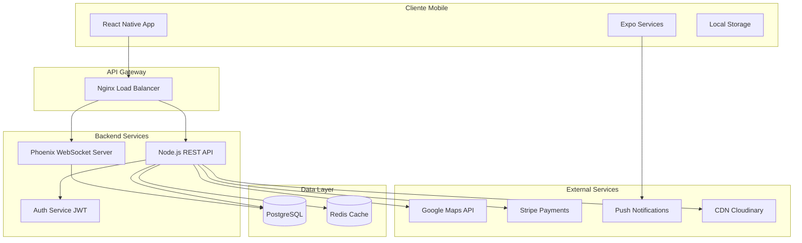

# 🚀 Pidelo – Plataforma de Delivery Inteligente

<div align="center">

 <!-- Reemplaza con tu logo -->

**Conectando negocios locales con clientes a través de tecnología de última generación**

[](https://reactnative.dev/)
[](https://expo.dev/)
[](https://www.typescriptlang.org/)
[](LICENSE)

[Demo](#-demo) • [Características](#-características-principales) • [Instalación](#-instalación-y-configuración) • [Documentación](#-documentación) • [Contribuir](#-contribuir)

</div>

---

## 📋 Tabla de Contenidos

- [Sobre el Proyecto](#-sobre-el-proyecto)
- [Problema y Solución](#-problema-y-solución)
- [Características Principales](#-características-principales)
- [Tecnologías](#-tecnologías-utilizadas)
- [Arquitectura](#-arquitectura-del-sistema)
- [Estructura del Proyecto](#-estructura-del-proyecto)
- [Instalación y Configuración](#-instalación-y-configuración)
- [Uso](#-uso)
- [Roadmap](#-roadmap)
- [Contribuir](#-contribuir)
- [Licencia](#-licencia)
- [Contacto](#-contacto)

---

## 🎯 Sobre el Proyecto

**Pidelo** es una plataforma integral de delivery que revoluciona la forma en que negocios locales y clientes se conectan. Desarrollada con React Native y Expo, ofrece una experiencia móvil nativa fluida con seguimiento en tiempo real, gestión administrativa completa y asistencia inteligente mediante chatbot.

### 🌟 Visión

Democratizar el acceso a tecnología de delivery profesional para pequeños y medianos negocios, permitiéndoles competir con grandes plataformas sin inversión técnica compleja.

### 🎥 Demo

<div align="center">

<!-- Añade capturas de pantalla o GIFs -->
| Onboarding | Home Feed | Tracking en Vivo |
|:---:|:---:|:---:|
|  |  |  |

</div>

---

## 🔍 Problema y Solución

### Problemas Identificados

| Problema | Impacto | Solución Pidelo |
|----------|---------|-----------------|
| **Gestión desorganizada** | Pérdida de pedidos, errores frecuentes | Sistema centralizado con confirmación automática |
| **Falta de visibilidad** | Clientes frustrados, llamadas constantes | Tracking GPS en tiempo real con notificaciones push |
| **Procesos manuales** | Errores humanos, lentitud operativa | Digitalización completa del flujo de pedidos |
| **UX deficiente** | Carritos abandonados, baja conversión | Interfaz intuitiva con checkout en 3 pasos |
| **Barrera tecnológica** | Negocios excluidos del mercado digital | Onboarding guiado sin conocimientos técnicos |

### Propuesta de Valor

#### 👤 Para Clientes
- ✅ **Descubrimiento inteligente**: Encuentra negocios cercanos con filtros avanzados
- ✅ **Pedidos lightning-fast**: Checkout optimizado en menos de 1 minuto
- ✅ **Seguimiento transparente**: Visualiza cada etapa de tu orden en tiempo real
- ✅ **Asistencia 24/7**: Chatbot IA para resolver dudas instantáneamente
- ✅ **Historial y reordenamiento**: Repite tus pedidos favoritos en un tap

#### 🏪 Para Negocios
- ✅ **Digitalización sin código**: Setup completo en menos de 15 minutos
- ✅ **Panel administrativo completo**: Gestiona productos, precios e inventario
- ✅ **Analytics en tiempo real**: Visualiza ventas, productos top y horarios pico
- ✅ **Notificaciones inteligentes**: Alertas automáticas de nuevos pedidos
- ✅ **Reducción de errores**: Sistema automatizado elimina malentendidos

---

## ✨ Características Principales

### 🔐 Sistema de Autenticación Robusto
- Registro con validación de email/teléfono
- Login con JWT y refresh tokens
- Recuperación de contraseña segura
- Autenticación biométrica (Face ID / Touch ID)
- Selección de rol (Cliente / Negocio)

### 👥 Experiencia de Cliente

#### 🏠 Feed de Negocios
```typescript
- Búsqueda en tiempo real con autocompletado
- Filtros: tipo de comida, precio, rating, distancia
- Ordenamiento: populares, cercanos, mejor calificados
- Vista de mapa interactiva
- Favoritos sincronizados
```

#### 🛒 Sistema de Pedidos
```typescript
- Carrito persistente con sincronización
- Personalización de productos (extras, notas)
- Cálculo dinámico de costos (subtotal, envío, propinas)
- Múltiples métodos de pago (preparado)
- Programación de pedidos futuros
```

#### 📍 Tracking en Tiempo Real
```typescript
- Mapa interactivo con ubicación del repartidor
- Estados del pedido: Recibido → Preparando → En camino → Entregado
- Notificaciones push en cada cambio de estado
- Tiempo estimado de llegada (ETA) dinámico
- Chat directo con el repartidor (roadmap)
```

#### 💬 Chatbot Inteligente
```typescript
- Respuestas automáticas a preguntas frecuentes
- Asistencia en proceso de pedido
- Consulta de estado de órdenes
- Sugerencias personalizadas basadas en historial
```

### 🏢 Panel Administrativo para Negocios

#### 📊 Dashboard Analytics
```typescript
- Ventas del día/semana/mes con gráficos
- Productos más vendidos
- Horarios de mayor demanda
- Rating promedio y reviews recientes
- Tasa de conversión y métricas clave
```

#### 🍕 Gestión de Menú
```typescript
- CRUD completo de productos
- Categorización personalizada
- Gestión de inventario con alertas de stock bajo
- Imágenes optimizadas con compresión automática
- Modificadores y variantes (tamaños, extras)
- Control de disponibilidad por horarios
```

#### 📦 Administración de Órdenes
```typescript
- Vista en tiempo real de pedidos activos
- Aceptación/rechazo con tiempos de preparación
- Actualización de estados con notificación automática
- Historial completo de órdenes
- Generación de reportes exportables
- Integración con impresora térmica (roadmap)
```

#### ⚙️ Configuración de Negocio
```typescript
- Perfil completo: logo, descripción, horarios
- Zonas de cobertura con radio personalizable
- Configuración de costos de envío
- Métodos de pago aceptados
- Políticas de cancelación y devolución
```

---

## 🛠️ Tecnologías Utilizadas

### Frontend Mobile

| Tecnología | Versión | Propósito |
|------------|---------|-----------|
| **React Native** | 0.74+ | Framework principal para desarrollo móvil nativo |
| **Expo** | SDK 51+ | Toolchain y servicios (OTA updates, push notifications) |
| **TypeScript** | 5.3+ | Type safety y mejor developer experience |
| **React Navigation** | 6.x | Sistema de navegación y routing |
| **Zustand** | 4.x | State management ligero y performante |
| **React Query** | 5.x | Server state, caching y sincronización |
| **Axios** | 1.x | HTTP client con interceptors |
| **Socket.io Client** | 4.x | Comunicación en tiempo real vía WebSockets |
| **React Native Maps** | 1.x | Mapas interactivos con seguimiento GPS |
| **Expo Location** | 17.x | Geolocalización precisa |
| **Expo Notifications** | 0.28.x | Push notifications locales y remotas |
| **React Hook Form** | 7.x | Manejo de formularios con validación |
| **Zod** | 3.x | Schema validation |
| **React Native Reanimated** | 3.x | Animaciones de alto rendimiento |

### Backend (Preparado para Integración)

```typescript
// Stack principal
Node.js + Express          // API REST
Phoenix (Elixir)           // WebSockets y real-time
PostgreSQL                 // Base de datos relacional
Redis                      // Cache y sessions
Nginx                      // Reverse proxy y load balancer

// Autenticación y Seguridad
JWT + Refresh Tokens       // Autenticación stateless
Bcrypt                     // Hashing de contraseñas
Helmet.js                  // Security headers
Rate Limiting              // Protección contra abuse

// Integración de Servicios
Stripe API                 // Pagos en línea
Google Maps API            // Geocoding y rutas
Twilio                     // SMS y verificación de teléfono
SendGrid                   // Emails transaccionales
Cloudinary                 // Optimización y CDN de imágenes
```

### DevOps e Infraestructura

```yaml
- Docker & Docker Compose    # Containerización
- GitHub Actions             # CI/CD automatizado
- EAS Build                  # Compilación de binarios nativos
- EAS Submit                 # Publicación automática en stores
- Sentry                     # Error tracking y monitoring
- Akash Network              # Deployment descentralizado (opcional)
```

---

## 🏛️ Arquitectura del Sistema

### Diagrama de Arquitectura



### Patrones de Diseño

#### Frontend
- **Component Composition**: Componentes reutilizables con props tipadas
- **Custom Hooks**: Lógica compartida encapsulada (`useAuth`, `useOrders`, `useLocation`)
- **Context + Hooks**: State management global con React Context API
- **Repository Pattern**: Abstracción de llamadas API en servicios
- **Observer Pattern**: Suscripción a eventos en tiempo real (WebSockets)

#### Backend (Arquitectura Preparada)
- **MVC Architecture**: Separación de modelos, controladores y vistas
- **Microservices Ready**: Servicios independientes comunicados vía API
- **Event-Driven**: Eventos de dominio con pub/sub pattern
- **CQRS**: Separación de comandos y queries (para escalar)
- **API Gateway**: Punto único de entrada con rate limiting

---

## 📂 Estructura del Proyecto

```
pidelo/
│
├── .expo/                          # Configuración de Expo
├── .github/
│   └── workflows/
│       ├── ci.yml                  # Tests y linting automáticos
│       └── deploy.yml              # Deployment a EAS
│
├── assets/                         # Recursos estáticos
│   ├── images/
│   │   ├── logo.png
│   │   ├── onboarding/
│   │   └── icons/
│   ├── fonts/
│   └── animations/                 # Lottie files
│
├── backend/                        # Backend (Node.js + Phoenix)
│   ├── api/                        # API REST (Node.js/Express)
│   │   ├── controllers/
│   │   ├── models/
│   │   ├── routes/
│   │   ├── middlewares/
│   │   ├── services/
│   │   └── utils/
│   │
│   ├── realtime/                   # Real-time server (Phoenix/Elixir)
│   │   ├── channels/
│   │   ├── controllers/
│   │   └── lib/
│   │
│   ├── database/
│   │   ├── migrations/
│   │   ├── seeds/
│   │   └── config/
│   │
│   └── docker-compose.yml
│
├── frontend/
│   ├── src/
│   │   ├── components/             # Componentes reutilizables
│   │   │   ├── common/
│   │   │   │   ├── Button.tsx
│   │   │   │   ├── Input.tsx
│   │   │   │   ├── Card.tsx
│   │   │   │   ├── Modal.tsx
│   │   │   │   └── LoadingSpinner.tsx
│   │   │   │
│   │   │   ├── business/
│   │   │   │   ├── BusinessCard.tsx
│   │   │   │   ├── ProductCard.tsx
│   │   │   │   └── CategoryFilter.tsx
│   │   │   │
│   │   │   └── order/
│   │   │       ├── OrderCard.tsx
│   │   │       ├── OrderStatus.tsx
│   │   │       └── CartItem.tsx
│   │   │
│   │   ├── navigation/
│   │   │   ├── StackNavigation.tsx
│   │   │   ├── TabNavigation.tsx
│   │   │   ├── AuthNavigator.tsx
│   │   │   └── types.ts            # Navigation types
│   │   │
│   │   ├── screens/
│   │   │   ├── onboarding/
│   │   │   │   └── Onboarding.tsx
│   │   │   │
│   │   │   ├── auth/
│   │   │   │   ├── Login.tsx
│   │   │   │   ├── Signup.tsx
│   │   │   │   ├── ForgotPassword.tsx
│   │   │   │   └── AccountTypeSelection.tsx
│   │   │   │
│   │   │   ├── customer/
│   │   │   │   ├── homeFeed/
│   │   │   │   │   ├── HomeFeed.tsx
│   │   │   │   │   └── BusinessDetails.tsx
│   │   │   │   │
│   │   │   │   ├── cart/
│   │   │   │   │   ├── Cart.tsx
│   │   │   │   │   └── Checkout.tsx
│   │   │   │   │
│   │   │   │   ├── orders/
│   │   │   │   │   ├── OrdersList.tsx
│   │   │   │   │   ├── OrderDetails.tsx
│   │   │   │   │   └── OrderTracking.tsx
│   │   │   │   │
│   │   │   │   └── profile/
│   │   │   │       ├── Profile.tsx
│   │   │   │       ├── EditProfile.tsx
│   │   │   │       ├── Addresses.tsx
│   │   │   │       └── Favorites.tsx
│   │   │   │
│   │   │   ├── business/
│   │   │   │   ├── dashboard/
│   │   │   │   │   └── Dashboard.tsx
│   │   │   │   │
│   │   │   │   ├── orders/
│   │   │   │   │   ├── ActiveOrders.tsx
│   │   │   │   │   ├── OrderHistory.tsx
│   │   │   │   │   └── OrderDetails.tsx
│   │   │   │   │
│   │   │   │   ├── menu/
│   │   │   │   │   ├── MenuManagement.tsx
│   │   │   │   │   ├── AddProduct.tsx
│   │   │   │   │   ├── EditProduct.tsx
│   │   │   │   │   └── Categories.tsx
│   │   │   │   │
│   │   │   │   ├── settings/
│   │   │   │   │   ├── BusinessSettings.tsx
│   │   │   │   │   ├── DeliveryZones.tsx
│   │   │   │   │   └── Notifications.tsx
│   │   │   │   │
│   │   │   │   └── analytics/
│   │   │   │       └── Analytics.tsx
│   │   │   │
│   │   │   ├── chatbot/
│   │   │   │   └── Chatbot.tsx
│   │   │   │
│   │   │   └── SplashScreen.tsx
│   │   │
│   │   ├── services/               # API calls y lógica de negocio
│   │   │   ├── api/
│   │   │   │   ├── client.ts       # Axios instance configurado
│   │   │   │   ├── auth.service.ts
│   │   │   │   ├── business.service.ts
│   │   │   │   ├── order.service.ts
│   │   │   │   ├── product.service.ts
│   │   │   │   └── user.service.ts
│   │   │   │
│   │   │   ├── websocket/
│   │   │   │   └── socket.service.ts
│   │   │   │
│   │   │   └── storage/
│   │   │       └── asyncStorage.service.ts
│   │   │
│   │   ├── hooks/                  # Custom hooks
│   │   │   ├── useAuth.ts
│   │   │   ├── useOrders.ts
│   │   │   ├── useLocation.ts
│   │   │   ├── useNotifications.ts
│   │   │   └── useWebSocket.ts
│   │   │
│   │   ├── store/                  # State management (Zustand)
│   │   │   ├── authStore.ts
│   │   │   ├── cartStore.ts
│   │   │   ├── orderStore.ts
│   │   │   └── businessStore.ts
│   │   │
│   │   ├── types/                  # TypeScript types y interfaces
│   │   │   ├── auth.types.ts
│   │   │   ├── business.types.ts
│   │   │   ├── order.types.ts
│   │   │   ├── product.types.ts
│   │   │   └── user.types.ts
│   │   │
│   │   ├── utils/                  # Utilidades y helpers
│   │   │   ├── constants.ts
│   │   │   ├── formatters.ts
│   │   │   ├── validators.ts
│   │   │   └── permissions.ts
│   │   │
│   │   ├── theme/                  # Theming y estilos
│   │   │   ├── colors.ts
│   │   │   ├── typography.ts
│   │   │   ├── spacing.ts
│   │   │   └── theme.ts
│   │   │
│   │   └── config/                 # Configuraciones
│   │       ├── env.ts
│   │       └── firebase.ts         # Si usas Firebase
│   │
│   ├── App.tsx
│   └── index.js
│
├── docs/                           # Documentación
│   ├── API.md
│   ├── CONTRIBUTING.md
│   └── ARCHITECTURE.md
│
├── .env.example                    # Variables de entorno ejemplo
├── .eslintrc.js                    # Configuración de ESLint
├── .prettierrc                     # Configuración de Prettier
├── app.json                        # Configuración de Expo
├── babel.config.js
├── eas.json                        # Configuración de EAS Build
├── package.json
├── tsconfig.json
├── README.md
└── LICENSE
```

---

## 🚀 Instalación y Configuración

### Prerrequisitos

Asegúrate de tener instalado:

- **Node.js** >= 18.x ([Descargar](https://nodejs.org/))
- **npm** >= 9.x o **yarn** >= 1.22.x
- **Expo CLI**: `npm install -g expo-cli`
- **Git**: `git --version`
- **iOS Simulator** (macOS) o **Android Studio** (Windows/macOS/Linux)

### Instalación Paso a Paso

#### 1️⃣ Clonar el Repositorio

```bash
git clone https://github.com/alextafale/Pidelo.git
cd Pidelo
```

#### 2️⃣ Instalar Dependencias

```bash
# Usando npm
npm install

# O usando yarn
yarn install
```

#### 3️⃣ Configurar Variables de Entorno

Crea un archivo `.env` en la raíz del proyecto:

```bash
cp .env.example .env
```

Edita `.env` con tus credenciales:

```env
# API Configuration
API_BASE_URL=http://localhost:3000/api
WEBSOCKET_URL=ws://localhost:4000

# Google Maps
GOOGLE_MAPS_API_KEY=tu_api_key_aqui

# Firebase (Notificaciones Push)
FIREBASE_API_KEY=tu_firebase_key
FIREBASE_PROJECT_ID=tu_project_id

# Sentry (Error Tracking)
SENTRY_DSN=tu_sentry_dsn

# Environment
NODE_ENV=development
```

#### 4️⃣ Ejecutar el Proyecto

```bash
# Iniciar Expo Dev Server
npx expo start

# O con limpieza de cache
npx expo start -c
```

#### 5️⃣ Ejecutar en Dispositivo/Emulador

Opciones disponibles tras ejecutar `expo start`:

- **`i`** - Abrir en iOS Simulator (requiere macOS + Xcode)
- **`a`** - Abrir en Android Emulator (requiere Android Studio)
- **Escanear QR** - Usar app Expo Go en tu teléfono físico

### Configuración del Backend (Opcional)

Si deseas ejecutar el backend localmente:

```bash
cd backend

# Instalar dependencias
npm install

# Configurar base de datos
cp .env.example .env
# Edita .env con credenciales de PostgreSQL

# Ejecutar migraciones
npm run migrate

# Seed de datos de prueba
npm run seed

# Iniciar servidor
npm run dev
```

El backend estará disponible en `http://localhost:3000`

---

## 💻 Uso

### Credenciales de Prueba

Para testing, puedes usar estas cuentas:

#### Cliente
```
Email: cliente@test.com
Password: Test123!
```

#### Negocio
```
Email: negocio@test.com
Password: Test123!
```

### Flujo de Usuario Típico

#### Para Clientes:

1. **Registro/Login** → Selecciona "Cliente" como tipo de cuenta
2. **Explora negocios** → Usa filtros y búsqueda en el Home Feed
3. **Selecciona productos** → Añade al carrito con personalizaciones
4. **Checkout** → Confirma dirección y método de pago
5. **Tracking** → Visualiza el estado en tiempo real
6. **Recibe tu pedido** → Califica la experiencia

#### Para Negocios:

1. **Registro/Login** → Selecciona "Negocio" como tipo de cuenta
2. **Configura tu perfil** → Logo, descripción, horarios, zonas
3. **Añade productos** → Crea tu menú con fotos y precios
4. **Recibe pedidos** → Notificación automática de nuevos pedidos
5. **Gestiona órdenes** → Acepta, prepara y actualiza estados
6. **Analiza métricas** → Revisa dashboard con ventas y tendencias

---

## 🗺️ Roadmap

### ✅ Fase 1: MVP (Completado)
- [x] Autenticación y registro
- [x] Navegación y estructura base
- [x] Pantallas principales (Home, Orders, Profile)
- [x] Panel administrativo básico

### 🚧 Fase 2: Core Features (En Desarrollo)
- [ ] Integración backend completo
- [ ] Sistema de pedidos end-to-end
- [ ] Tracking GPS en tiempo real
- [ ] WebSockets para actualizaciones live
- [ ] Carrito persistente con sincronización
- [ ] Sistema de notificaciones push

### 📅 Fase 3: Features Avanzados (Q2 2025)
- [ ] Integración de pagos (Stripe/MercadoPago)
- [ ] Chat en tiempo real cliente-repartidor
- [ ] Sistema de calificaciones y reviews
- [ ] Programa de fidelización (puntos/cupones)
- [ ] Recomendaciones personalizadas con ML
- [ ] Soporte multi-idioma (i18n)

### 🎯 Fase 4: Escalabilidad (Q3 2025)
- [ ] Optimización de performance
- [ ] CDN para imágenes
- [ ] Cache avanzado con Redis
- [ ] Analytics detallado para negocios
- [ ] Panel de super-admin
- [ ] API pública para integraciones

### 🌟 Fase 5: Diferenciadores (Q4 2025)
- [ ] Modo oscuro
- [ ] Pedidos programados/recurrentes
- [ ] Múltiples direcciones de entrega
- [ ] Split payments (pago compartido)
- [ ] Integración con redes sociales
- [ ] Gamificación (badges, logros)

---

## 🤝 Contribuir

¡Las contribuciones son bienvenidas! Este proyecto está abierto a mejoras y nuevas ideas.

### Cómo Contribuir

1. **Fork** el proyecto
2. **Crea una rama** para tu feature:
   ```bash
   git checkout -b feature/AmazingFeature
   ```
3. **Commit** tus cambios:
   ```bash
   git commit -m 'Add: Amazing new feature'
   ```
4. **Push** a la rama:
   ```bash
   git push origin feature/AmazingFeature
   ```
5. **Abre un Pull Request**

### Guía de Estilo

- Usa **TypeScript** para todos los archivos nuevos
- Sigue las convenciones de **ESLint** y **Prettier**
- Escribe **tests** para nuevas funcionalidades
- Documenta funciones complejas con **JSDoc**
- Commits descriptivos siguiendo [Conventional Commits](https://www.conventionalcommits.org/)

### Reportar Bugs

Usa [GitHub Issues](https://github.com/alextafale/Pidelo/issues) con esta plantilla:

```markdown
**Descripción del Bug**
[Descripción clara del problema]

**Pasos para Reproducir**
1. Ve a '...'
2. Haz click en '...'
3. Scroll hasta '...'

**Comportamiento Esperado**
[Lo que debería pasar]

**Screenshots**
[Si aplica]

**Entorno**
- Dispositivo: [ej. iPhone 14]
- OS: [ej. iOS 17.1]
- Versión de la App: [ej. 1.0.0]
```

---

## 📄 Licencia

Distribuido bajo la licencia **MIT**. Ver `LICENSE` para más información.

---

## 👨‍💻 Contacto

**Alex Tafale**

- GitHub: [@alextafale](https://github.com/alextafale)
- Email: alex@pidelo.app
- LinkedIn: [linkedin.com/in/alextafale](https://linkedin.com/in/alextafale)

**Link del Proyecto**: [https://github.com/alextafale/Pidelo](https://github.com/alextafale/Pidelo)

---

## 🙏 Agradecimientos

- [React Native](https://reactnative.dev/)
- [Expo](https://expo.dev/)
- [React Navigation](https://reactnavigation.org/)
- [Zustand](https://github.com/pmndrs/zustand)
- Comunidad open-source

---

<div align="center">

**⭐ Si este proyecto te resulta útil, considera darle una estrella en GitHub**

Made with ❤️ by [Alex Tafale](https://github.com/alextafale)

</div>
